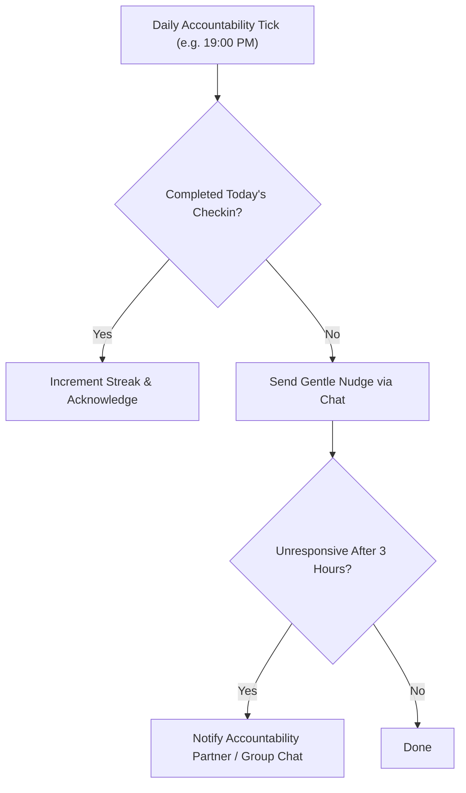

# genpark-habit-accountability-commitment-loop-skill

> Habit Loop & Behavioral Accountability Engine. 100% Python Standard Library.

Distilled from **Tomo** and **Ollie**, orchestrating behavioral micro-commitments, streak counters, and peer accountability nudges inside direct messaging environments.

## Architecture

## Features
- **Streak & Consistency Metrics**: Quantifies continuous habit tracking.
- **Accountability Partner Sync**: Seamlessly loops in friends, mentors, or family members.
